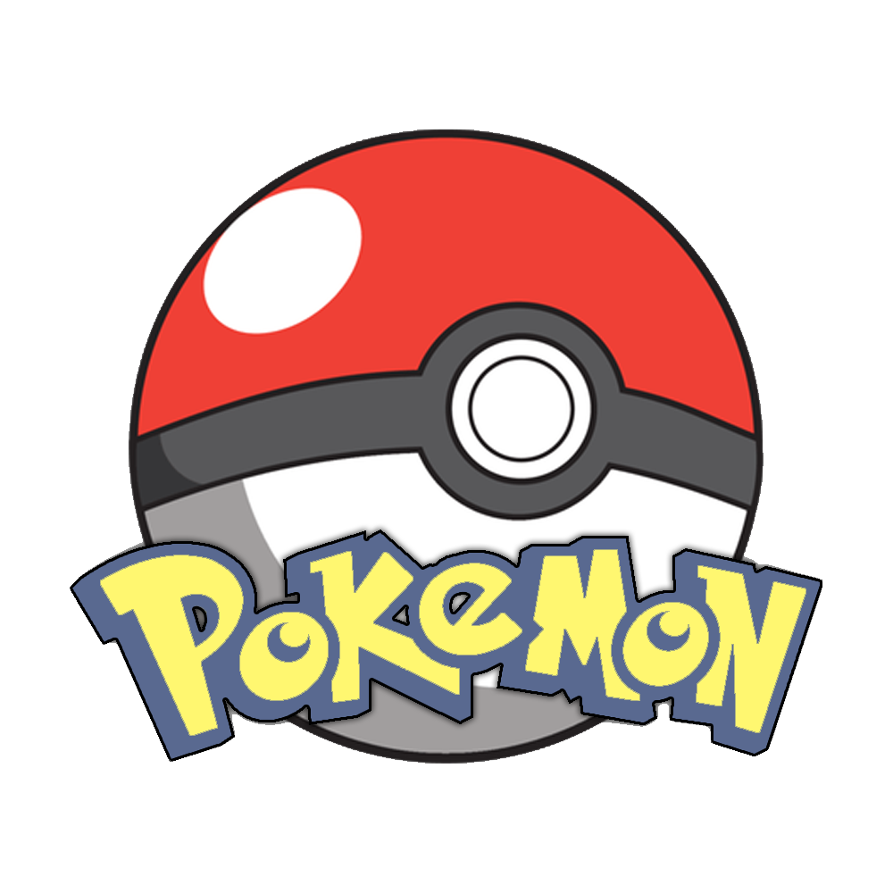

<h1 align="center">Pokedex</h1>

## Décomposition du code : 

Basé sur la méthode de Laravel. 

Circulation des data : View (create.blade.php) -> fonction store dans 
<a href="core/AbstractController.php">AbstractController</a>  -> 
fonction dataCheck dans <a href="core/Request.php">Request</a> ->
fonction SavePokemon dans <a href="models/PokemonModel.php">PokemonModel</a> ->
fonction save dans <a href="core/AbstractModel.php">AbstractModel</a>. Voilà le chemin 
que prends les data avant d'être stocké en BDD. Je précise que pour l'instant je me suis limité à ce que vous demandiez
car ça m'a pris énormément de temps pour construire une base basé sur Laravel (je n'ai utilisé aucun package de Laravel au fait ;))
. Donc pour l'instant il n'y a que la sauvegarde des données. La suppression est plutôt simple, j'ai déja ma fonction dans mon AbstractModel.
La fonction edit n'est pas encore au point car c'est la méthode save de l'AbstractModel mais on fait un if sur l'id.

<small>PS : Il y a un truc classe sur le show.blade.php (bien sur il faut aller dans le listing des pokémons et cliquer sur le "i" du pokémon :))</small>

## Améliorations : 

- Fonction d'édition
- Ajout de la fonction dd()
- Ajout des générations des Pokémons
- Optimisation du code
- Un Laravel mais en plus léger :)
- Corriger la Request pour type_id (car c'est un array maintenant au lieu d'un simple champ, à cause du select multiple)

Voilà n'hésitez pas à inspecter le code et à tester bien sur :). J'ai aussi mis en place
des messages d'erreurs de request, donc par exemple pour la création du Pokémon, si le name n'est pas saisi et qu'on
envoie, ça nous renvoi une erreur de Request.

Concernant le Type, même s'il n'est pas rempli, cela nous renvoie aucune erreur de Request car quand j'envoie ça ne me le met pas en POST.

